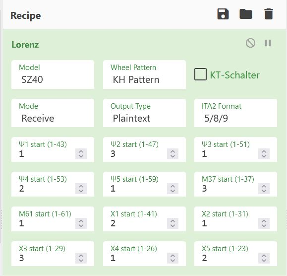

The first clues for this challenge are both the name and the description.

The description mentions that someone reused a key, and the title is "The Hero of History". If one were to remember WWII, one would know that the Lorenz machine was cryptanalyzed due to the germans using the same key to encrypt different texts. 

This problem also has two flag files, which reinforces that theory.

The Lorenz machine has twelve switches.

What if the author used the same magic number to create a pattern as they did in other challenges? The description does mention reuse of keys...

If one were to solve Hidden, another challenge in this CTF, one would already know that this author has used the sequence of numbers '1312520'.

This pattern doesn't work on the Lorenz, as it would cut-off. However, what if we try to repeats chunks of this pattern? Indeed, 1312 works as a pattern.

Extra hints for the switch configuration: the pattern used in The Well of Chaos was 4 digits long!